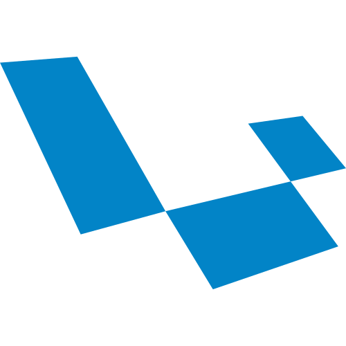

<br />
<div align="center">
    
</div>

<h1 align="center">Foundation</h1>

<p align="center">
    A modern Laravel-based web application built with elegant simplicity and developer productivity in mind.<br />
    Fully powered by <strong>Laravel</strong>, <strong>Livewire</strong>, <strong>Bootstrap</strong>, and <strong>jQuery</strong>.
    <br />
    <br />
    <a href="https://laravel.com">
        
</a>
    <a href="https://www.typescriptlang.org/">
        
    </a>
    <a href="https://vuejs.org/">
        
    </a>
    <a href="https://inertiajs.com/">
        
    </a>
    <a href="https://tailwindcss.com/">
        
    </a>

</p>

---

## ⚙️ Prerequisites

Before installing, make sure you have the following:

- **PHP** `^8.2`
- **Composer** `^2.x`
- **PostgreSQL or MySQL** or compatible database
- **Laravel Valet** for local development (optional)

---

## 🚀 Installation

1. **Clone the repository**
   ```bash
   git clone git@github.com:chrisquices/foundation.git
   cd foundation
   ```

2. **Install dependencies**
   ```bash
   composer install
   npm install
   ```

3. **Create the environment file**
   ```bash
   cp .env.example .env
   ```

4. **Generate the application key**
   ```bash
   php artisan key:generate
   ```

5. **Create the storage symlink**
   ```bash
   php artisan storage:link
   ```

6. **Configure the `.env` file**
   Set your environment variables. Adjust APP_URL as needed.
   ```env
   APP_URL=https://foundation.test
   ```

7. **Run migrations with seed data**
   ```bash
   php artisan migrate:fresh --seed
   ```

---

## 💻 Usage

To access the application locally:

```
https://foundation.test
```

### Demo Credentials

| Role                       | Email                    | Password |
|----------------------------|--------------------------|----------|
| Foundation Admin | admin@foundation.com     | password |

---

## 🧑‍💻 Contributing

Contributions are welcome!  
Please fork the repository and create a pull request, or open an issue for discussion before making changes.

---

## 📄 License

This project is open-sourced under the [MIT License](LICENSE).

---
